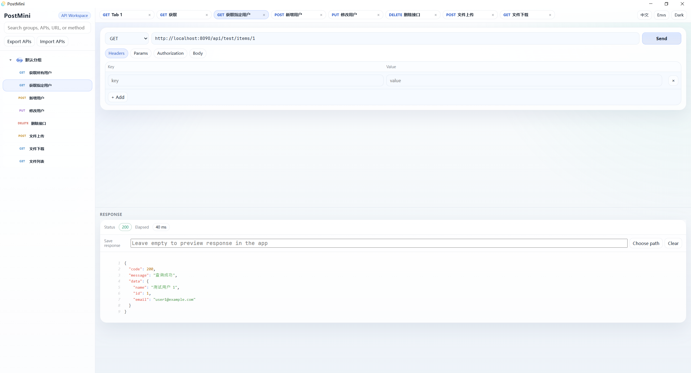

# PostMini

> A lightweight Windows desktop API client built with Tauri, React, TypeScript, and Rust.

PostMini is a native-feeling API debugging tool for people who want the speed of a small desktop app without the weight of a full API platform.

It focuses on one thing: making everyday HTTP testing fast, clean, and local.

## Why PostMini

Most API tools are either:

- browser-based and constrained by the web
- powerful but heavy
- great for teams, but overkill for quick local testing

PostMini takes a different route:

- Desktop-first: runs as a real Windows app, not a localhost page in your browser
- Small and direct: open it, send requests, inspect responses, done
- Local by default: your grouped interfaces and environment variables stay on your machine
- Rust-powered requests: HTTP is sent from the native layer, which is better suited for desktop tooling

## What Makes It Different

- Native Windows desktop app powered by Tauri
- Supports `GET`, `POST`, `PUT`, `DELETE`
- JSON request editing
- `form-data` support with file upload
- Save large responses directly to disk
- Interface grouping for organizing APIs by module or project
- Multiple tabs for parallel debugging
- Environment variable templating such as `{{base_url}}`
- Light and dark theme support
- Export and import interface collections as JSON

## Best For

- Backend developers testing internal APIs
- Frontend developers verifying endpoints during integration
- Solo builders who want a faster Postman alternative for routine work
- Windows users who prefer a standalone `.exe` workflow

## Current Interface

The UI is intentionally simple:

- Left side: interface groups and saved interfaces
- Top: tabs for switching between requests
- Main editor: method, URL, headers, body, files, response-save path
- Right side: response preview with status, timing, and formatted output

## Feature Snapshot

### 1. Grouped Interfaces

Create custom groups, add interfaces under each group, rename them, delete them, and reopen them later without rebuilding the request from scratch.

### 2. Real Desktop Request Flow

Requests are executed through Rust commands instead of relying on browser networking behavior. That makes the app feel more like a native tool and less like a webpage wrapped in a shell.

### 3. Large Response Handling

For big downloads or binary responses, PostMini can write the response stream directly to a file instead of forcing everything into the preview panel.

### 4. Portable Interface Export

Your grouped interfaces can be exported to JSON and imported later, which is useful for:

- moving setups between machines
- sharing a small collection with teammates
- keeping lightweight local backups

## Tech Stack

- Frontend: React 19 + TypeScript + Vite
- Desktop shell: Tauri 2
- Native layer: Rust
- HTTP engine: `reqwest`

## Project Structure

```text
src/
  components/    UI components
  store/         local app state
  utils/         invoke wrappers, templates, storage helpers
  App.tsx        main app shell

src-tauri/
  src/lib.rs     Rust commands and file operations
  tauri.conf.json
```

## Development

### Requirements

For Windows development, you typically need:

- Node.js
- Rust
- Tauri prerequisites
- WebView2 runtime

Official Tauri setup guide:

- [Tauri Prerequisites](https://tauri.app/start/prerequisites/)

### Run In Dev Mode

```bash
npm install
npm run tauri dev
```

## Build

```bash
npm run tauri build
```

The main generated executable is:

```text
src-tauri/target/release/postmini.exe
```

This repository currently sets `bundle.active` to `false` in `src-tauri/tauri.conf.json`, so the build focuses on producing the executable directly instead of installer packaging.

## Packaging Notes

If you want MSI or NSIS installers later, you can enable bundling again in `src-tauri/tauri.conf.json` and follow the official Windows distribution guide:

- [Tauri Windows Distribution](https://v2.tauri.app/distribute/windows/)

## Philosophy

PostMini is not trying to become a huge API platform.

It is designed to be:

- fast to open
- easy to understand
- pleasant for daily local debugging
- small enough to maintain

## Roadmap Ideas

- request duplication
- drag-and-drop sorting inside groups
- response header panel
- better success/error notifications
- installer packaging for release builds

## Screenshots

You can add screenshots here after publishing:

```md


```

## License

Choose the license you want for GitHub release, for example:

- MIT
- Apache-2.0
- GPL-3.0

If you want, I can also help you add a `LICENSE` file next.
